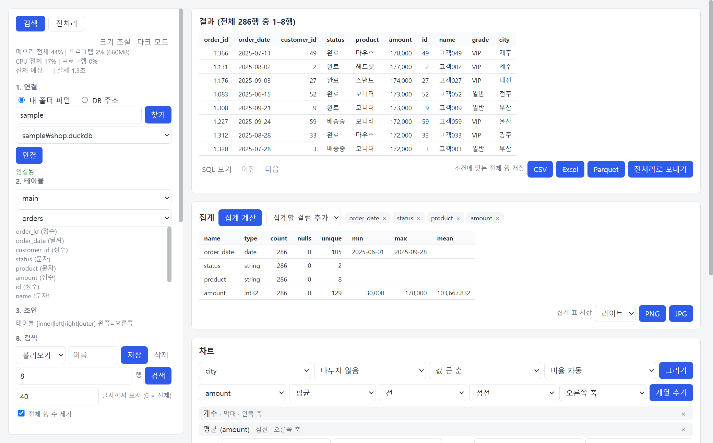
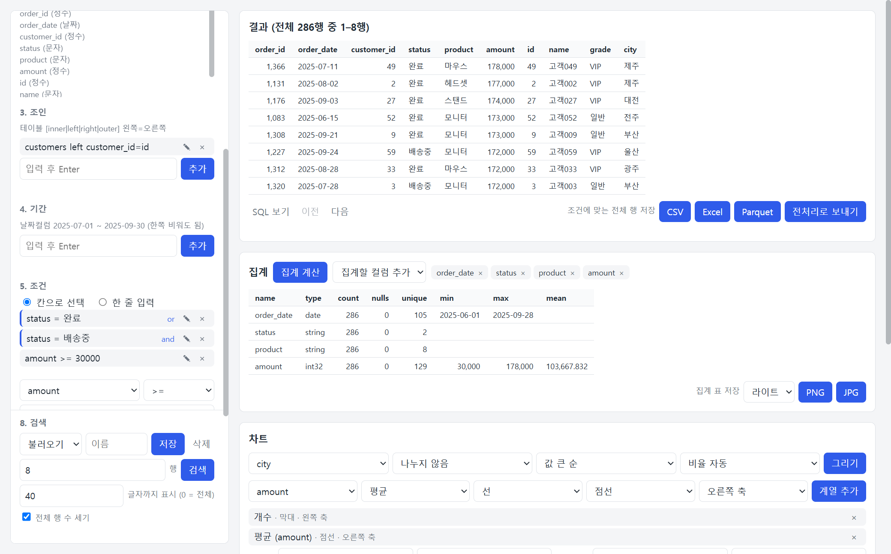
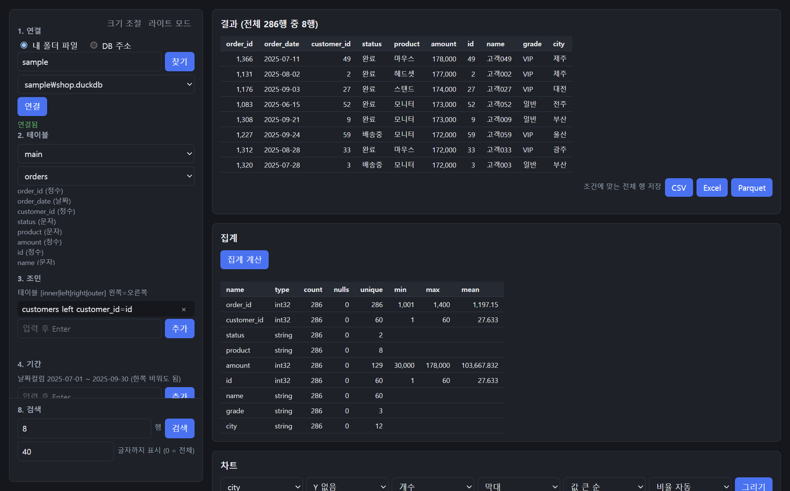
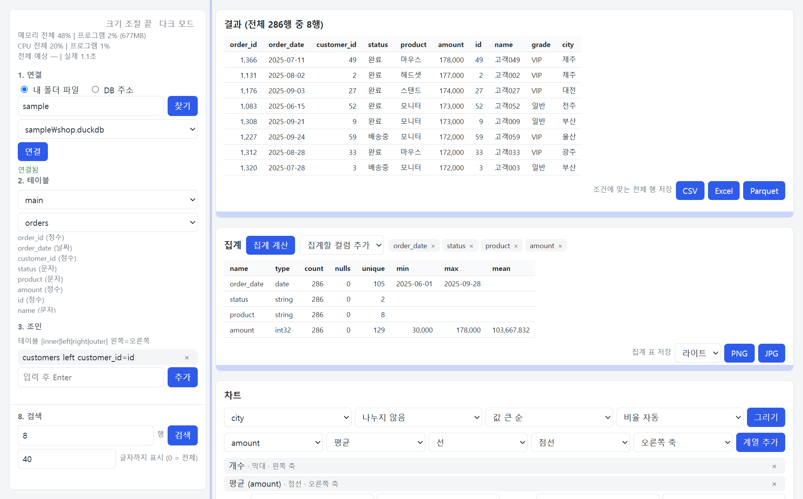

# ibis_search

DB·DW 또는 내 데이터 파일(DuckDB, Parquet, CSV)에 연결해, 테이블·조인·기간·조건을 골라 검색하는 Windows 프로그램입니다. 결과를 표와 차트로 보고 파일로 저장할 수 있습니다.



화면에 보이는 데이터는 설명을 위해 지어낸 예시입니다. 아래의 다른 그림도 같습니다.

## 목차

- [프로그램 받기](#프로그램-받기)
- [빠르게 써 보기](#빠르게-써-보기)
- [연결](#연결)
- [테이블, 조인, 기간](#테이블-조인-기간)
- [조건](#조건)
- [정렬, 표시 컬럼, 검색](#정렬-표시-컬럼-검색)
- [결과](#결과)
- [화면 설정](#화면-설정)
- [소스로 실행하기](#소스로-실행하기)
- [DB별 드라이버](#db별-드라이버)
- [라이선스](#라이선스)

## 프로그램 받기

1. GitHub 저장소의 Actions 탭 → `build-exe` → `Run workflow`를 누릅니다.
2. 완료된 실행 화면 아래 Artifacts에서 `ibis_search-windows`(zip)를 내려받습니다.
3. 압축을 풀고 `ibis_search.exe`를 실행합니다. 폴더 안의 다른 파일은 지우지 않습니다.

서명되지 않은 프로그램이라 Windows SmartScreen 경고가 나오면 [추가 정보] → [실행]을 누릅니다.

프로그램은 자체 창으로만 열립니다. 브라우저로는 열 수 없습니다.

## 빠르게 써 보기

왼쪽 패널에서 위에서 아래로 진행합니다.

1. **연결**: 폴더 경로를 넣고 [찾기] → 파일을 고르고 [연결].
2. **테이블**: 기준 테이블을 고릅니다.
3. **조건**: 컬럼, 연산자, 값을 고르고 [추가]. 필요한 만큼 반복합니다.
4. **검색**: 패널 아래쪽의 [검색]을 누릅니다.

오른쪽에 결과 표가 나옵니다. 그 아래에서 [집계 계산]으로 컬럼별 집계를 보고, 차트를 그리고, 결과를 파일로 저장합니다.

조인, 기간, 정렬, 표시 컬럼은 필요할 때만 넣습니다. 시간이 걸리는 버튼은 진행되는 동안 잠깁니다.

## 연결

"1. 연결"에서 방식을 고릅니다.

### 내 폴더 파일

폴더 경로를 넣고 [찾기]를 누르면 그 폴더와 하위 폴더에서 `.duckdb`, `.parquet`, `.csv` 파일을 찾습니다. 이름이 `.`으로 시작하는 폴더는 찾지 않습니다.

**DuckDB 파일**은 목록에서 하나를 고르고 [연결]을 누릅니다.

**Parquet·CSV 파일**은 여러 개를 골라 엽니다.

1. 목록에서 [Parquet·CSV 파일 고르기]를 고릅니다. 찾은 파일이 체크 목록으로 나옵니다. 처음에는 아무것도 체크되어 있지 않습니다.
2. 쓸 파일만 체크합니다. [모두 선택]으로 한꺼번에 체크할 수 있고, 고른 개수가 옆에 표시됩니다.
3. [연결]을 누릅니다.

고른 파일마다 테이블이 하나씩 생깁니다. 파일 이름이 테이블 이름이 되고, 고른 파일 중 이름이 같은 것이 여럿이면 `폴더_이름_확장자`(예: `sub_orders_csv`)로 구분합니다.

### DB 주소

연결 주소(예: `duckdb://data.duckdb`, `mssql://host:1433/db`)와 아이디, 비밀번호를 넣고 [연결]을 누릅니다. 필요 없는 항목은 비웁니다. DB별 주소 형식은 [DB별 드라이버](#db별-드라이버)에 있습니다.

비밀번호는 프로그램이 켜져 있는 동안 메모리에만 두고, 오류 문구에서는 가립니다.

### 연결을 바꾸거나 끊을 때

- **다시 연결**: 새로 연결하면 이전 연결은 닫히고, 이전에 고른 테이블과 조건은 비워집니다.
- **연결 실패**: 없는 파일이나 틀린 주소로 연결에 실패하면 이전 연결이 그대로 유지됩니다.
- **[모두 해제]**: 체크를 모두 풉니다. 이때 지금 연결이 무엇이냐에 따라 다르게 동작합니다.

| 지금 연결 | [모두 해제]를 누르면 |
|---|---|
| Parquet·CSV 파일 | 연결을 끊고 화면이 연결 전 상태로 돌아갑니다. 파일을 다시 고르고 [연결]을 누르면 새로 연결됩니다. |
| DuckDB 파일, DB 주소 | 연결은 그대로 두고, 고른 테이블과 조건, 결과 표·집계·차트만 비웁니다. 테이블을 다시 고르면 이어서 씁니다. |

## 테이블, 조인, 기간

### 테이블

스키마(DB에서만)와 기준 테이블을 고릅니다. 고르면 컬럼 이름과 타입이 아래에 표시됩니다.

### 조인

```
customers left customer_id=id
```

형식: `테이블 [inner|left|right|outer] 왼쪽컬럼=오른쪽컬럼`

- 종류를 빼면 inner입니다.
- 컬럼 이름이 같으면 이름만 씁니다.
- 컬럼이 여러 개면 쉼표로 나눕니다.

### 기간

```
order_date 2025-07-01 ~ 2025-07-31
order_date 2025-07-01 ~
```

형식: `날짜컬럼 시작 ~ 끝`. 한쪽은 비워도 됩니다. 날짜시간 컬럼에 끝을 날짜로만 쓰면 그날 끝까지 포함합니다.

조인과 기간은 한 줄씩 입력하고 Enter나 [추가]를 누르면 목록에 들어갑니다. `×`로 뺍니다.

## 조건



위쪽 목록에 넣은 조건이 쌓이고, 그 아래에서 새 조건을 넣습니다.

### 넣는 방식

"5. 조건"에서 방식을 고릅니다. 두 방식으로 넣은 조건은 같은 목록에 쌓입니다.

**칸으로 선택**

1. 컬럼을 고릅니다.
2. 연산자를 고릅니다. 컬럼 타입에 맞는 연산자만 보입니다.
3. 값을 넣고 [추가]를 누릅니다.

값을 넣는 방법은 컬럼과 연산자에 따라 다릅니다.

| 경우 | 값 넣기 |
|---|---|
| 숫자, 날짜 컬럼 | 직접 입력 |
| 문자 컬럼 | 직접 입력하거나, [목록]을 눌러 그 컬럼에 있는 값을 불러와 고르기 |
| `between` | 값 칸 두 개 |
| `in`, `except` | 목록에서 고를 때마다 쉼표로 이어 붙음 |
| `is null`, `is not null` | 값 없음 |

[목록]은 누를 때만 DB를 조회하고, 최대 200개까지 보여 줍니다. 더 많으면 앞의 200개만 나오므로 나머지는 직접 입력합니다.

**한 줄 입력**

```
amount >= 1000
status = 완료
amount between 1000 5000
status in 완료, 취소
status except 완료, 취소
status like 완
status is not null
status = 완료 or amount >= 3000
```

### 연산자

| 연산자 | 뜻 |
|---|---|
| `=`, `!=` | 같다, 다르다 |
| `>=`, `<=`, `>`, `<` | 크기 비교 (숫자, 날짜) |
| `between 값1 값2` | 값1 이상 값2 이하 (숫자, 날짜) |
| `in 값1, 값2` | 적은 값 중 하나 |
| `except 값1, 값2` | 적은 값을 제외 |
| `like 값` | 값이 포함된 것 (문자 컬럼, 대소문자 구분 없음) |
| `is null`, `is not null` | 값이 비어 있다, 비어 있지 않다 |

`!=`와 `except`는 값이 비어 있는 행도 함께 제외합니다.

### and와 or

목록의 각 조건 오른쪽에 있는 [and] / [or]를 누르면 다음 조건과의 연결이 바뀝니다. 새로 넣은 조건은 and로 이어집니다.

`or`로 이어진 조건끼리 먼저 묶이고, 묶음끼리는 `and`입니다. 묶인 조건은 왼쪽에 세로선으로 표시됩니다.

| 목록 | 뜻 |
|---|---|
| `A` [and] `B` [and] `C` | A이면서 B이면서 C |
| `A` [or] `B` [and] `C` | (A 또는 B)이면서 C |
| `A` [and] `B` [or] `C` | A이면서 (B 또는 C) |
| `A` [or] `B` [or] `C` | A 또는 B 또는 C |

SQL은 and를 먼저 묶지만 여기서는 or를 먼저 묶습니다. 화면의 세로선이 실제 묶음입니다.

한 줄 입력에서는 한 줄 안에 `조건 or 조건`으로 직접 쓸 수도 있습니다. 그 줄은 하나의 묶음입니다.

### 따옴표

값에 `or`나 쉼표가 들어 있으면 작은따옴표나 큰따옴표로 감쌉니다. 따옴표는 빼고 검색합니다.

```
title = 'black or white'
name in 'Kim, Lee', Park
```

칸으로 선택할 때는 이런 값을 프로그램이 알아서 감쌉니다.

따옴표가 실제로 들어 있는 값을 찾으려면 입력칸 아래의 체크 [따옴표로 값 감싸기 ('값')]를 끄고 추가합니다. 그 조건은 따옴표를 글자 그대로 찾고, 목록에 "따옴표 그대로"라고 표시됩니다. 체크는 추가할 때의 상태가 그 조건에만 적용됩니다.

## 정렬, 표시 컬럼, 검색

### 정렬

```
amount desc
status
```

형식: `컬럼 [asc|desc]`. 빼면 asc이고, 먼저 넣은 줄이 우선입니다.

### 표시 컬럼

```
status, amount
```

비우면 전체 컬럼을 보여 줍니다. 표시하지 않는 컬럼도 조건과 정렬에는 쓸 수 있습니다.

### 검색

볼 행 수(1 이상)를 정하고 [검색]을 누릅니다. [검색]은 패널을 어디로 스크롤해도 아래쪽에 보입니다.

검색 전까지는 테이블 이름과 컬럼 정보만 읽고, [검색]을 누를 때 연산합니다. 입력한 줄의 형식이 맞지 않거나 없는 컬럼이면 넣는 자리에서 이유를 알려 주고, 비슷한 이름이 있으면 함께 알려 줍니다.

## 결과

### 결과 표

- 제목에 조건에 맞는 전체 행 수와 지금 보이는 행 수가 나옵니다.
- 문자열은 [검색] 아래에서 정한 글자 수까지만 보입니다(기본 40, 0이면 전체). 잘린 값은 마우스를 올리면 전체가 보입니다.

### 저장

표 아래의 [CSV], [Excel], [Parquet]을 누르면 화면의 행 수와 상관없이 조건에 맞는 전체 행을 저장합니다.

- Excel은 1,048,575행까지 저장합니다. 더 많으면 CSV나 Parquet으로 저장합니다.
- CSV는 Excel에서 바로 열어도 한글이 깨지지 않습니다.

### 집계

[집계 계산]을 누르면 지금 조건으로 컬럼별 개수, 빈 값, 고유값, 최소, 최대, 평균을 계산합니다. 큰 테이블에서는 오래 걸릴 수 있어 검색과 따로 계산하고, 새로 검색하면 지워집니다.

### 차트

X 컬럼, Y 컬럼, 집계 방식, 종류, 순서, 비율을 고르고 [그리기]를 누릅니다.

| 고르는 것 | 내용 |
|---|---|
| Y와 집계 방식 | 개수는 [Y 없음]으로 두고, 합계와 평균은 숫자 컬럼을 Y로 고릅니다 |
| 종류 | 막대 또는 선 |
| 순서 | [X 순] 또는 [값 큰 순]. 최대 50개 그룹까지 표시합니다 |
| 비율 | [비율 자동], [1:1], [16:9] |

[비율 자동]이면 그룹이 5개 이하일 때 정방형(1:1)이고, 그룹이 늘수록 넓어져 25개 이상이면 16:9가 됩니다.

차트 아래의 [PNG], [JPG]를 누르면 화면에 보이는 비율 그대로 그림 파일로 저장합니다. 그 왼쪽에서 그림의 모드([라이트]는 흰 배경, [다크]는 어두운 배경)를 고릅니다. 화면 모드와 따로 정합니다.

차트의 컬럼은 표시 컬럼과 상관없이 전체 컬럼에서 고릅니다. 차트는 프로그램에 들어 있는 Chart.js 4.5.1을 사용해 인터넷 없이 그립니다.

## 화면 설정

### 화면 모드

패널 오른쪽 위의 [다크 모드] / [라이트 모드]를 누르면 바뀝니다. 처음에는 Windows 설정을 따릅니다. 라이트 모드는 맨 위의 그림이고, 다크 모드는 아래와 같습니다.



### 크기 조절

1. 패널 오른쪽 위의 [크기 조절]을 누릅니다. 조절할 수 있는 경계가 옅게 표시됩니다.
2. 경계를 끌어서 크기를 바꿉니다. 더블클릭하면 기본 크기로 돌아갑니다.
3. 다 바꿨으면 [크기 조절 끝]을 누릅니다.

| 경계 | 바뀌는 것 |
|---|---|
| 왼쪽 패널과 결과 영역 사이 | 패널 너비 |
| 결과 카드 아래쪽 가장자리 | 결과 표 높이 |
| 집계 카드 아래쪽 가장자리 | 집계 표 높이 |
| 차트 카드 아래쪽 가장자리 | 차트 높이. 너비는 고른 비율에 맞춰 함께 바뀝니다 |

[크기 조절]이 꺼져 있는 동안에는 경계가 보이지 않고 끌리지도 않습니다. 아래는 [크기 조절]을 켠 화면입니다.



### 스크롤바

스크롤할 때만 내용 위에 반투명하게 나타납니다.

### 기억되는 설정

아래 항목은 바꿀 때마다 `%APPDATA%\ibis_search\settings.json`에 저장되어 다음 실행 때도 그대로 쓰입니다. 이 파일을 지우면 처음 상태로 돌아갑니다.

- 화면 모드
- 조건을 넣는 방식과 따옴표 체크
- 차트 비율과 차트 그림의 모드
- 끌어서 조절한 크기

연결 정보와 비밀번호, 넣어 둔 조건은 기억하지 않습니다.

## 소스로 실행하기

exe를 만들지 않고 같은 프로그램 창을 띄울 수 있습니다.

```bash
pip install -r requirements.txt
```

```bash
python desktop.py
```

DuckDB, Parquet, CSV 외의 DB에 접속하려면 해당 백엔드를 추가로 설치합니다. 설치되지 않은 DB에 접속하면 프로그램이 이 명령을 안내합니다.

```bash
pip install 'ibis-framework[mssql]'      # [] 안은 DB 이름: oracle, clickhouse, snowflake 등
```

## DB별 드라이버

접속하기 전에 그 DB에 필요한 드라이버가 있는지 확인하고, 없으면 설치 방법이나 다운로드 주소를 알려 줍니다. 주소 뒤에 `?키=값&키=값`을 붙이면 그 DB의 추가 접속 설정으로 넘어갑니다.

| DB | 주소 예 | 따로 설치할 것 |
|---|---|---|
| DuckDB | `duckdb://data.duckdb` | 없음 |
| SQLite | `sqlite://data.db` | 없음 |
| MSSQL | `mssql://host:1433/db` | [ODBC Driver 17/18 for SQL Server](https://learn.microsoft.com/sql/connect/odbc/download-odbc-driver-for-sql-server) |
| PostgreSQL | `postgres://host:5432/db` | 없음 |
| MySQL | `mysql://host:3306/db` | 없음 |
| Oracle | `oracle://host:1521/db` | 없음 |
| ClickHouse | `clickhouse://host:8123/db` | 없음 |
| Trino | `trino://host:8080/catalog/schema` | 없음 |
| Snowflake | `snowflake://계정/데이터베이스/스키마?warehouse=WH` | 없음 |
| BigQuery | `bigquery://프로젝트/데이터셋` | 없음 (처음 접속 시 Google 로그인) |
| Databricks | `databricks://?server_hostname=호스트&http_path=경로&access_token=토큰` | 없음 |
| Athena | `athena://?s3_staging_dir=s3://버킷/경로&region_name=ap-northeast-2` | 없음 (AWS 자격 증명) |
| Druid, Exasol, Impala, Materialize, RisingWave, SingleStore | `druid://host:8082/druid/v2/sql` 등 | 없음 |
| Spark, Flink | `pyspark://`, `flink://` | [Java](https://adoptium.net/). exe에는 포함되지 않아 소스로 실행할 때만 사용합니다 (`pip install 'ibis-framework[pyspark]'`) |

MSSQL은 설치된 ODBC 드라이버 중 최신 버전을 자동으로 고릅니다. 다른 드라이버를 쓰려면 주소 끝에 `?driver=드라이버이름`을 붙입니다. 아이디·비밀번호를 모두 비우면 Windows 인증으로 접속합니다.

## 라이선스

MIT 라이선스로 배포합니다. 전문은 [LICENSE](LICENSE)에 있습니다. 함께 들어 있는 Chart.js(`static/chart.umd.min.js`)도 MIT 라이선스입니다.
