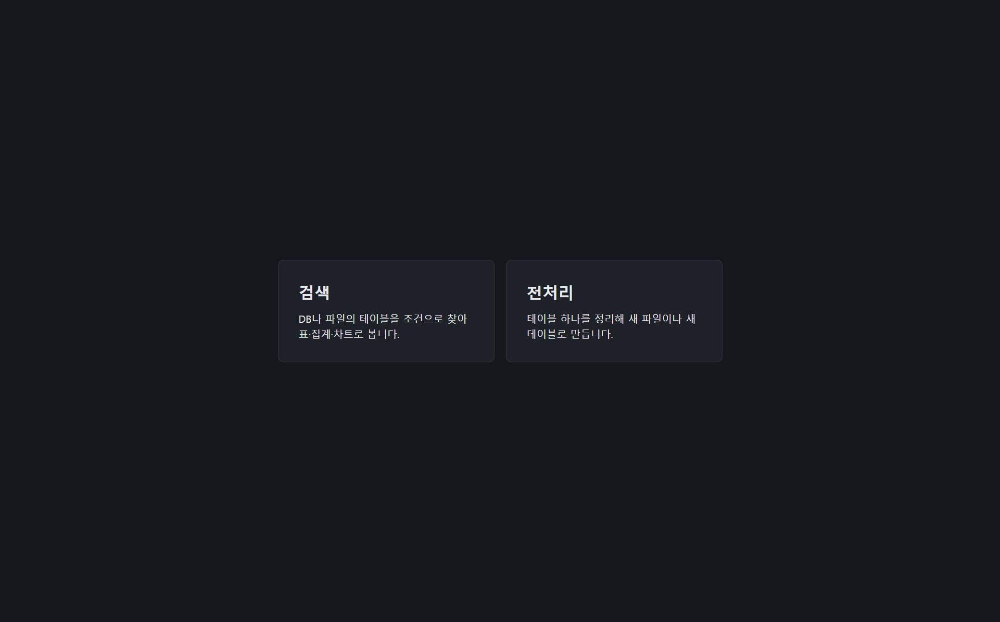
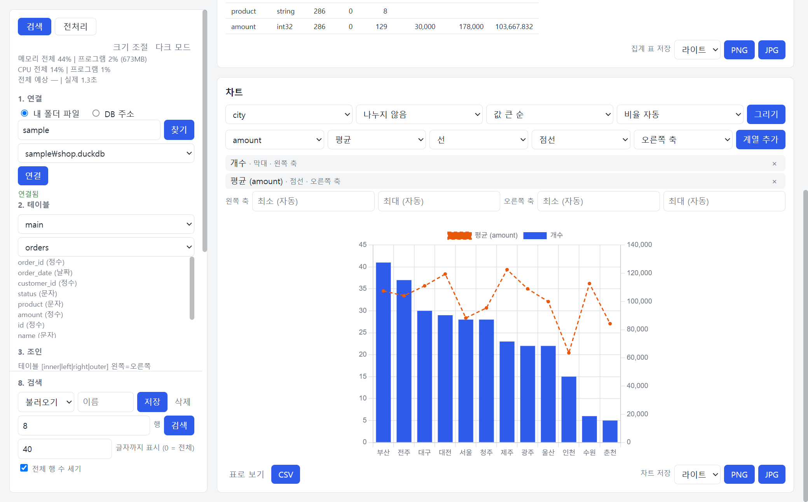
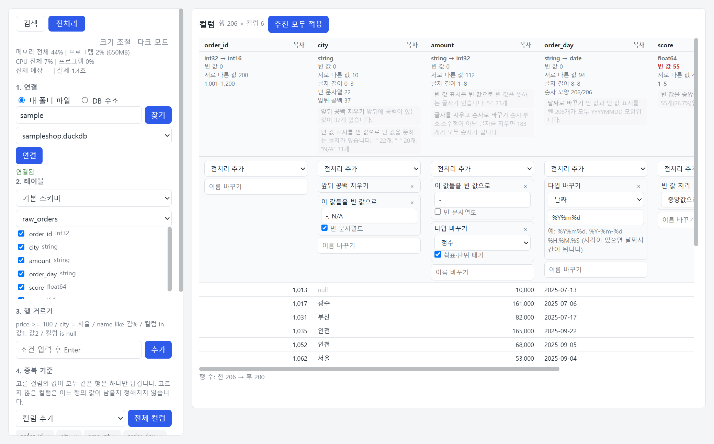

# ibis_search

DB·DW 또는 내 데이터 파일(DuckDB, Parquet, CSV)에 연결해, 테이블·조인·기간·조건을 골라 검색하는 Windows 프로그램입니다. 결과를 표와 집계, 차트로 보고 파일로 저장합니다. DB의 데이터는 읽기만 하고 바꾸지 않습니다.

전처리 화면도 함께 들어 있습니다. 테이블 하나를 골라 컬럼마다 정리 방법을 정하고, 결과를 새 파일이나 새 테이블로 만듭니다. 사용법은 [전처리](#전처리)에 있습니다.


화면에 보이는 데이터는 설명을 위해 지어낸 예시입니다. 아래의 다른 그림도 같습니다.

## 할 수 있는 일

| 하는 일 | 내용 |
|---|---|
| 연결 | DuckDB 파일, 여러 개의 Parquet·CSV 파일, 주소로 접속하는 DB 20여 종 |
| 검색 만들기 | 조인, 기간, 조건(and/or 묶음), 정렬, 표시 컬럼을 골라 넣고, 넣은 줄을 고치고, 이름을 붙여 저장 |
| 결과 보기 | 표(쪽 넘기기, 머리글 정렬), 컬럼별 집계, 여러 계열을 겹친 차트 |
| 내보내기 | 결과를 CSV·Excel·Parquet으로, 집계 표와 차트를 PNG·JPG로, 차트 값을 CSV로 |
| 돌리기 전에 확인 | DB에 보내질 SQL 보기, 예상 시간 |
| 도는 동안 | 걸린 시간과 메모리·CPU 표시, 취소 |

## 목차

- [프로그램 받기](#프로그램-받기)
- [검색과 전처리 고르기](#검색과-전처리-고르기)
- [빠르게 써 보기](#빠르게-써-보기)
- [연결](#연결)
- [검색 만들기](#검색-만들기)
- [조건](#조건)
- [검색하기](#검색하기)
- [결과](#결과)
- [차트](#차트)
- [전처리](#전처리)
- [진행 상황과 취소](#진행-상황과-취소)
- [화면 설정](#화면-설정)
- [안전하게 쓰기](#안전하게-쓰기)
- [기억되는 것](#기억되는-것)
- [소스로 실행하기](#소스로-실행하기)
- [DB별 드라이버](#db별-드라이버)
- [라이선스](#라이선스)

## 프로그램 받기

1. GitHub 저장소의 Actions 탭 → `build-exe` → `Run workflow`를 누릅니다.
2. 완료된 실행 화면 아래 Artifacts에서 `ibis_search-windows`(zip)를 내려받습니다.
3. 압축을 풀고 `ibis_search.exe`를 실행합니다. 폴더 안의 다른 파일은 지우지 않습니다.

서명되지 않은 프로그램이라 Windows SmartScreen 경고가 나오면 [추가 정보] → [실행]을 누릅니다.

프로그램은 자체 창으로만 열립니다. 브라우저로는 열 수 없습니다.

## 검색과 전처리 고르기

실행하면 첫 화면에서 [검색]과 [전처리] 중 하나를 고릅니다.



- 들어간 뒤에는 왼쪽 패널 맨 위의 [검색] [전처리]로 오갑니다.
- 연결은 두 화면이 함께 씁니다. 한쪽에서 연결했으면 다른 쪽에서 다시 연결하지 않아도 됩니다.
- 화면을 오가면 넣어 둔 조건이나 전처리 선택은 사라집니다. 검색 쪽은 [검색 저장](#검색-저장과-불러오기)으로 남겨 둘 수 있습니다.
- 검색한 결과를 전처리로 넘기려면 결과 표 아래의 [전처리로 보내기](#전처리로-보내기)를 누릅니다.

## 빠르게 써 보기

아래는 검색 화면의 순서입니다. 전처리 화면은 [전처리](#전처리)에 있습니다.


왼쪽 패널에서 위에서 아래로 진행합니다.

1. **연결**: 폴더 경로를 넣고 [찾기] → 파일을 고르고 [연결].
2. **테이블**: 기준 테이블을 고릅니다.
3. **조건**: 컬럼, 연산자, 값을 고르고 [추가]. 필요한 만큼 반복합니다.
4. **검색**: 패널 아래쪽의 [검색]을 누릅니다.

오른쪽에 결과 표가 나옵니다. 그 아래에서 [집계 계산]으로 컬럼별 집계를 보고, 차트를 그리고, 결과를 파일로 저장합니다.

조인, 기간, 정렬, 표시 컬럼은 필요할 때만 넣습니다. 시간이 걸리는 버튼은 진행되는 동안 잠기고, 패널 위쪽의 [취소]로 멈출 수 있습니다.

## 연결

"1. 연결"에서 방식을 고릅니다. 마지막으로 연결한 폴더나 주소, 아이디는 다음 실행 때 칸에 채워져 있습니다.

### 내 폴더 파일

폴더 경로를 넣고 [찾기]를 누르면 그 폴더와 하위 폴더에서 `.duckdb`, `.parquet`, `.csv` 파일을 찾습니다. 이름이 `.`으로 시작하는 폴더는 찾지 않습니다.

**DuckDB 파일**은 목록에서 하나를 고르고 [연결]을 누릅니다.

**Parquet·CSV 파일**은 여러 개를 골라 엽니다.

1. 목록에서 [Parquet·CSV 파일 고르기]를 고릅니다. 찾은 파일이 체크 목록으로 나옵니다. 처음에는 아무것도 체크되어 있지 않습니다.
2. 쓸 파일만 체크합니다. [모두 선택]으로 한꺼번에 체크할 수 있고, 고른 개수가 옆에 표시됩니다.
3. [연결]을 누릅니다.

고른 파일마다 테이블이 하나씩 생깁니다. 파일 이름이 테이블 이름이 되고, 고른 파일 중 이름이 같은 것이 여럿이면 `폴더_이름_확장자`(예: `sub_orders_csv`)로 구분합니다.

### DB 주소

연결 주소(예: `duckdb://data.duckdb`, `mssql://host:1433/db`)와 아이디, 비밀번호를 넣고 [연결]을 누릅니다. 필요 없는 항목은 비웁니다. DB별 주소 형식은 [DB별 드라이버](#db별-드라이버)에 있습니다.

60초 안에 연결되지 않으면 기다리기를 멈추고 알려 줍니다. 주소가 틀렸거나 네트워크가 막혀 있을 때입니다.

### 연결을 바꾸거나 끊을 때

- **다시 연결**: 새로 연결하면 이전 연결은 닫히고, 이전에 고른 테이블과 조건은 비워집니다.
- **연결 실패**: 없는 파일이나 틀린 주소로 연결에 실패하면 이전 연결이 그대로 유지됩니다.
- **[모두 해제]**: 체크를 모두 풉니다. 이때 지금 연결이 무엇이냐에 따라 다르게 동작합니다.

| 지금 연결 | [모두 해제]를 누르면 |
|---|---|
| Parquet·CSV 파일 | 연결을 끊고 화면이 연결 전 상태로 돌아갑니다. 파일을 다시 고르고 [연결]을 누르면 새로 연결됩니다. |
| DuckDB 파일, DB 주소 | 연결은 그대로 두고, 고른 테이블과 조건, 결과 표·집계·차트만 비웁니다. 테이블을 다시 고르면 이어서 씁니다. |

## 검색 만들기

패널의 2번부터 7번까지가 검색의 내용입니다. 검색 전까지는 테이블 이름과 컬럼 정보만 읽고, [검색]을 누를 때 연산합니다.

### 넣고, 고치고, 빼기

조인, 기간, 조건, 정렬, 표시 컬럼은 모두 같은 방식으로 다룹니다.

| 하는 일 | 방법 |
|---|---|
| 넣기 | 한 줄을 입력하고 Enter나 [추가] |
| 고치기 | 목록의 `✎`를 누르면 그 줄이 입력 칸에 들어갑니다. 고쳐서 Enter를 누르면 같은 자리에서 바뀝니다 |
| 빼기 | 목록의 `×` |

형식이 맞지 않거나 없는 컬럼이면 넣는 자리에서 이유를 알려 주고, 비슷한 이름이 있으면 함께 알려 줍니다. 고치다가 틀리면 원래 줄이 그대로 남습니다.

### 테이블

스키마(DB에서만)와 기준 테이블을 고릅니다. 고르면 컬럼 이름과 타입이 아래에 표시됩니다.

### 조인

```
customers left customer_id=id
```

형식: `테이블 [inner|left|right|outer] 왼쪽컬럼=오른쪽컬럼`

- 종류를 빼면 inner입니다.
- 컬럼 이름이 같으면 이름만 씁니다.
- 컬럼이 여러 개면 쉼표로 나눕니다.

### 기간

```
order_date 2025-07-01 ~ 2025-07-31
order_date 2025-07-01 ~
```

형식: `날짜컬럼 시작 ~ 끝`. 한쪽은 비워도 됩니다. 날짜시간 컬럼에 끝을 날짜로만 쓰면 그날 끝까지 포함합니다.

### 정렬

```
amount desc
status
```

형식: `컬럼 [asc|desc]`. 빼면 asc이고, 먼저 넣은 줄이 우선입니다. 결과 표의 머리글을 눌러서 정할 수도 있습니다.

### 표시 컬럼

```
status, amount
```

비우면 전체 컬럼을 보여 줍니다. 표시하지 않는 컬럼도 조건과 정렬에는 쓸 수 있습니다.

## 조건


위쪽 목록에 넣은 조건이 쌓이고, 그 아래에서 새 조건을 넣습니다.

### 넣는 방식

"5. 조건"에서 방식을 고릅니다. 두 방식으로 넣은 조건은 같은 목록에 쌓입니다.

**칸으로 선택**

1. 컬럼을 고릅니다.
2. 연산자를 고릅니다. 컬럼 타입에 맞는 연산자만 보입니다.
3. 값을 넣고 [추가]를 누릅니다.

값을 넣는 방법은 컬럼과 연산자에 따라 다릅니다.

| 경우 | 값 넣기 |
|---|---|
| 숫자, 날짜 컬럼 | 직접 입력 |
| 문자 컬럼 | 직접 입력하거나, [목록]을 눌러 그 컬럼에 있는 값을 불러와 고르기 |
| `between` | 값 칸 두 개 |
| `in`, `except` | 목록에서 고를 때마다 쉼표로 이어 붙음 |
| `is null`, `is not null` | 값 없음 |

[목록]은 누를 때만 DB를 조회하고, 최대 200개까지 보여 줍니다. 더 많으면 앞의 200개만 나오므로 나머지는 직접 입력합니다.

**한 줄 입력**

```
amount >= 1000
status = 완료
amount between 1000 5000
status in 완료, 취소
status except 완료, 취소
status like 완
status is not null
status = 완료 or amount >= 3000
```

넣은 조건을 `✎`로 고칠 때는 한 줄 입력으로 바뀝니다.

### 연산자

| 연산자 | 뜻 |
|---|---|
| `=`, `!=` | 같다, 다르다 |
| `>=`, `<=`, `>`, `<` | 크기 비교 (숫자, 날짜) |
| `between 값1 값2` | 값1 이상 값2 이하 (숫자, 날짜) |
| `in 값1, 값2` | 적은 값 중 하나 |
| `except 값1, 값2` | 적은 값을 제외 |
| `like 값` | 값이 포함된 것 (문자 컬럼, 대소문자 구분 없음) |
| `is null`, `is not null` | 값이 비어 있다, 비어 있지 않다 |

`!=`와 `except`는 값이 비어 있는 행도 함께 제외합니다.

### and와 or

목록의 각 조건 오른쪽에 있는 [and] / [or]를 누르면 다음 조건과의 연결이 바뀝니다. 새로 넣은 조건은 and로 이어집니다. 조건을 고쳐도 연결은 그대로 남습니다.

`or`로 이어진 조건끼리 먼저 묶이고, 묶음끼리는 `and`입니다. 묶인 조건은 왼쪽에 세로선으로 표시됩니다.

| 목록 | 뜻 |
|---|---|
| `A` [and] `B` [and] `C` | A이면서 B이면서 C |
| `A` [or] `B` [and] `C` | (A 또는 B)이면서 C |
| `A` [and] `B` [or] `C` | A이면서 (B 또는 C) |
| `A` [or] `B` [or] `C` | A 또는 B 또는 C |

SQL은 and를 먼저 묶지만 여기서는 or를 먼저 묶습니다. 화면의 세로선이 실제 묶음입니다. 실제로 어떻게 보내지는지는 결과 표 아래의 [SQL 보기]로 확인합니다.

한 줄 입력에서는 한 줄 안에 `조건 or 조건`으로 직접 쓸 수도 있습니다. 그 줄은 하나의 묶음입니다.

### 따옴표

값에 `or`나 쉼표가 들어 있으면 작은따옴표나 큰따옴표로 감쌉니다. 따옴표는 빼고 검색합니다.

```
title = 'black or white'
name in 'Kim, Lee', Park
```

칸으로 선택할 때는 이런 값을 프로그램이 알아서 감쌉니다.

따옴표가 실제로 들어 있는 값을 찾으려면 입력칸 아래의 체크 [따옴표로 값 감싸기 ('값')]를 끄고 추가합니다. 그 조건은 따옴표를 글자 그대로 찾고, 목록에 "따옴표 그대로"라고 표시됩니다. 체크는 추가할 때의 상태가 그 조건에만 적용됩니다.

## 검색하기

"8. 검색"은 패널을 어디로 스크롤해도 아래쪽에 보입니다.

### 검색

볼 행 수(1 이상 10,000 이하)를 정하고 [검색]을 누릅니다. 더 많은 행은 결과 표 아래의 저장 버튼으로 내려받습니다.

### 전체 행 수 세기

체크가 켜져 있으면 조건에 맞는 전체 행 수를 함께 셉니다. 끄면 이렇게 달라집니다.

- 검색할 때 DB에 보내는 조회가 두 번에서 한 번으로 줍니다.
- 예상 시간을 구하려고 테이블의 행 수를 세는 일도 하지 않습니다. 걸린 시간은 그대로 나옵니다.
- 결과 제목에 전체 행 수가 빠집니다.

읽은 양만큼 요금이 나오는 DB에서는 끄고 씁니다.

### 검색 저장과 불러오기

테이블과 조인, 기간, 조건, 정렬, 표시 컬럼, 행 수를 이름을 붙여 저장해 둡니다. 연결 정보는 담지 않으므로 연결을 바꿔도 남아 있습니다.

| 하는 일 | 방법 |
|---|---|
| 저장 | [이름] 칸에 이름을 쓰고 [저장]. 이름을 비우면 지금 고른 검색에 덮어씁니다 |
| 불러오기 | [불러오기] 칸에서 고릅니다. 불러오기만 하고 검색은 하지 않습니다 |
| 삭제 | 고른 뒤 [삭제] |

지금 연결에 없는 테이블이나 컬럼이 들어 있는 검색은 불러오지 않고 이유를 알려 줍니다. 100개까지 저장합니다.

## 결과

### 결과 표

| 하는 일 | 방법 |
|---|---|
| 몇 행인지 보기 | 제목에 전체 행 수와 지금 보이는 범위가 나옵니다(예: 전체 286행 중 1–20행) |
| 다음 행 보기 | [이전], [다음]. 정렬을 정해 두어야 넘길 때 순서가 흔들리지 않습니다 |
| 정렬 바꾸기 | 머리글을 누르면 그 컬럼의 오름차순으로 다시 검색하고, 한 번 더 누르면 내림차순입니다. 정렬 목록은 그 컬럼 하나로 바뀝니다 |
| 보낼 SQL 보기 | [SQL 보기]. 조회는 하지 않습니다. Parquet·CSV 연결은 SQL을 쓰지 않아 볼 수 없습니다 |
| 긴 값 보기 | 문자열은 [검색] 아래에서 정한 글자 수까지만 보입니다(기본 40, 0이면 전체). 잘린 값은 마우스를 올리면 전체가 보입니다 |

### 결과 저장

표 아래의 [CSV], [Excel], [Parquet]을 누르면 화면의 행 수와 상관없이 조건에 맞는 전체 행을 저장합니다.

- Excel은 1,048,575행까지 저장합니다. 더 많으면 CSV나 Parquet으로 저장합니다.
- CSV는 Excel에서 바로 열어도 한글이 깨지지 않습니다.
- CSV와 Excel에서는 `=`, `+`, `-`, `@`로 시작하는 문자 값 앞에 `'`를 붙입니다. 이유는 [안전하게 쓰기](#안전하게-쓰기)에 있습니다. Parquet은 값을 그대로 둡니다.

### 전처리로 보내기

결과 표 아래의 [전처리로 보내기]를 누르면 다음 순서로 진행됩니다.

1. 저장할 위치와 이름을 묻습니다.
2. 조건에 맞는 전체 행을 그 위치에 Parquet 파일로 저장합니다. 값은 바꾸지 않고 그대로 씁니다.
3. 연결이 그 파일로 바뀌고, 전처리 화면이 그 테이블을 고른 상태로 열립니다.

연결이 저장한 파일로 바뀌므로, 원래 DB를 다시 보려면 다시 연결합니다. 지금 읽고 있는 파일과 같은 이름으로는 저장할 수 없습니다.

### 집계

[집계 계산]을 누르면 지금 조건으로 컬럼별 개수, 빈 값, 고유값, 최소, 최대, 평균을 계산합니다. 최소와 최대는 숫자와 날짜 컬럼에, 평균은 숫자 컬럼에만 나옵니다. 큰 테이블에서는 오래 걸릴 수 있어 검색과 따로 계산하고, 새로 검색하면 지워집니다.

**일부 컬럼만 집계하기**

제목 옆의 [집계할 컬럼 추가]에서 컬럼을 고릅니다. 고른 컬럼은 그 오른쪽에 하나씩 놓이고, `×`로 뺍니다. 한 줄에 다 들어가지 않으면 `… 외 N개`로 줄여 보이며, 누르면 모두 펼칩니다.

- 하나도 고르지 않으면 전체를 집계합니다(표시 컬럼을 정했으면 그 컬럼들).
- 고른 컬럼만 계산하므로 큰 테이블에서는 더 빨리 끝납니다.
- 표시 컬럼에 없는 컬럼도 고를 수 있습니다.

**그림으로 저장**

집계 표 아래의 [PNG], [JPG]를 누르면 표 전체를 그림 파일로 저장합니다. 화면에서 스크롤해야 보이는 행도 모두 들어갑니다. 그 왼쪽에서 그림의 모드([라이트]는 흰 배경, [다크]는 어두운 배경)를 고릅니다.

## 차트

차트 카드에는 설정 줄이 두 개 있습니다. 윗줄은 차트 전체에, 아랫줄은 계열(막대나 선 하나하나)에 적용됩니다.



**윗줄: 차트 전체**

| 고르는 것 | 내용 |
|---|---|
| X 컬럼 | 가로축에 놓을 컬럼 |
| 나누기 | 고른 컬럼의 값마다 계열을 따로 그립니다. [나누지 않음]이 기본입니다 |
| 순서 | [X 순] 또는 [값 큰 순]. 최대 50개 그룹까지 표시합니다 |
| 비율 | [비율 자동], [1:1], [16:9] |

**아랫줄: 계열**

| 고르는 것 | 내용 |
|---|---|
| Y와 집계 방식 | 개수는 [Y 없음]으로 두고, 합계와 평균은 숫자 컬럼을 Y로 고릅니다 |
| 종류 | 막대 또는 선 |
| 선 모양 | 실선 또는 점선 (선일 때만) |
| 축 | 왼쪽 축 또는 오른쪽 축 |

계열을 하나만 그릴 때는 아랫줄을 고르고 바로 [그리기]를 누릅니다. 차트의 컬럼은 표시 컬럼과 상관없이 전체 컬럼에서 고릅니다.

### 여러 계열 겹치기

1. 아랫줄에서 계열 하나를 고르고 [계열 추가]를 누릅니다. 아래 목록에 들어갑니다.
2. 겹칠 계열만큼 반복합니다. 목록의 `×`로 뺍니다.
3. [그리기]를 누르면 목록의 계열이 한 차트에 겹쳐 그려집니다.

예를 들면 이렇게 씁니다.

- 선 세 개: 평균, 합계, 개수를 각각 선으로 추가합니다. 그중 하나를 점선으로 바꿀 수 있습니다.
- 막대와 선: 개수는 막대로, 평균은 선으로 추가합니다.
- 크기가 많이 다른 값: 개수(수십)와 합계(수백만)처럼 차이가 크면 한쪽을 오른쪽 축으로 둡니다.

계열의 색은 넣은 순서대로 자동으로 정해지고, 계열이 둘 이상이면 범례가 나옵니다. [값 큰 순]은 첫 번째 계열의 값을 기준으로 합니다.

### 값별로 나누기

[나누기]에서 컬럼을 고르면 그 컬럼의 값마다 계열이 생깁니다. 예를 들어 X를 날짜, 나누기를 상태로 두면 상태별로 선이 하나씩 그려집니다. 값이 많으면 행이 많은 순으로 8개까지만 그립니다. 여러 계열과 함께 쓰면 계열마다 값별로 나뉩니다.

### 세로축 범위

계열 목록 아래에 [왼쪽 축]과 [오른쪽 축]의 최소, 최대 칸이 있습니다. 여기에 값을 넣으면 세로축이 그 범위로 고정됩니다. 비워 둔 칸은 자동으로 정해지고, 한쪽만 넣어도 됩니다. 넣는 즉시 차트에 반영되며, 저장하는 그림에도 같은 범위가 쓰입니다. 범위 밖의 값은 잘려서 보이지 않습니다.

### 비율

[비율 자동]이면 그룹이 5개 이하일 때 정방형(1:1)이고, 그룹이 늘수록 넓어져 25개 이상이면 16:9가 됩니다.

### 차트의 값을 표로 보기

차트 아래의 [표로 보기]를 누르면 차트에 그린 값을 표로 봅니다. 첫 컬럼이 X이고 계열마다 한 컬럼입니다. [CSV]로 그 표를 저장합니다. 도시별 건수와 평균 금액처럼 그룹별 값을 표로 받을 때 씁니다. 차트와 같이 50개 그룹까지입니다.

### 그림으로 저장

차트 아래의 [PNG], [JPG]를 누르면 화면에 보이는 비율 그대로 그림 파일로 저장합니다. 그 왼쪽에서 그림의 모드([라이트]는 흰 배경, [다크]는 어두운 배경)를 고릅니다. 화면 모드와 따로 정하고, 집계 표 저장과 같은 설정을 함께 씁니다.

차트는 프로그램에 들어 있는 Chart.js 4.5.1을 사용해 인터넷 없이 그립니다.

## 전처리

전처리 화면은 테이블 하나를 정리해 새 파일이나 새 테이블로 만듭니다. 원본 테이블은 바꾸지 않습니다. 연결, 화면 모드, 크기 조절, 위쪽의 사용량·시간·[취소]는 검색 화면과 같습니다.



### 쓰는 순서

1. **연결**하고 **테이블**을 고릅니다. 오른쪽에 컬럼이 가로로 한 줄씩 나오고, 컬럼마다 타입과 통계(빈 값 수, 서로 다른 값 수, 최소–최대 또는 글자 길이)가 보입니다. 이때 테이블 전체를 한 번 읽습니다.
2. 컬럼 아래의 [전처리 추가]에서 할 일을 고릅니다. 고른 것만 적용되고, 저절로 적용되는 것은 없습니다.
3. 필요하면 왼쪽에서 행 거르기, 중복 기준, 정렬을 넣습니다.
4. [미리보기]로 앞 20행과 전후의 행 수를 확인합니다.
5. 저장할 곳을 고르고 [실행]을 누릅니다.

설정을 바꾸면 표 아래에 미리보기를 다시 누르라는 안내가 나옵니다.

### 추천

통계를 보고 컬럼마다 할 만한 전처리를 근거와 함께 보여 줍니다. 누르면 그 컬럼의 선택에 들어가고, [추천 모두 적용]으로 한꺼번에 넣을 수 있습니다. 들어간 뒤에도 고치거나 뺄 수 있습니다.

| 보이는 상태 | 추천 |
|---|---|
| 앞뒤에 공백이 있는 값이 있음 | 앞뒤 공백 지우기 |
| `-`, `N/A`, 빈 문자열처럼 빈 값을 뜻하는 글자가 있음 | 그 글자를 빈 값으로 |
| 모든 값이 숫자 모양, 또는 쉼표·단위를 떼면 숫자 | 숫자로 바꾸기 |
| 모든 값이 `20250131`, `2025-01-31`, `2025-01-31 09:30:00` 모양 | 날짜로 바꾸기 |
| 대소문자만 다른 값이 있음 | 소문자로 통일 |
| 빈 값이 있음 | 적으면 그 행 빼기, 많으면 중앙값(수)이나 최빈값으로 채우기 |
| 값이 한 가지뿐이거나 전부 빈 값 | 컬럼 빼기 |

### 컬럼마다 고르는 전처리

한 컬럼에 여러 개를 고르면 아래 표의 위에서 아래 순서로 적용됩니다.

| 묶음 | 전처리 | 내용 |
|---|---|---|
| 글자 | 앞뒤 공백 지우기 | |
| 글자 | 연속 공백을 하나로 | |
| 글자 | 이 값들을 빈 값으로 | 쉼표로 구분해 적습니다. 예: `-, N/A` |
| 글자 | 글자 찾아 지우기 | 적은 글자를 그대로 찾아 지웁니다 |
| 글자 | 대문자·소문자로 | |
| 글자 | 값 바꿔 쓰기 | 값 전체가 같을 때만 바꿉니다 |
| 글자 | 패턴으로 바꾸기 | 정규식. 문법은 연결한 DB의 것을 따릅니다 |
| 타입 | 타입 바꾸기 | 정수, 실수, 글자, 날짜. 바꿀 수 없는 값은 빈 값이 됩니다 |
| 새 컬럼 | 빈 값이었는지 표시 | `컬럼_isnull` 컬럼이 생깁니다. 빈 값을 채우기 전의 상태입니다 |
| 빈 값 | 빈 값 처리 | 그 행 빼기, 또는 정한 값·평균·중앙값·최빈값·앞의 값·뒤의 값으로 채우기 |
| 숫자 | 범위 밖 값 처리 | 그 행을 빼거나 범위로 잘라 냅니다. 범위는 직접 넣거나 사분위수(IQR), 표준편차로 정합니다 |
| 숫자 | 값 맞추기 | 표준화, 0–1로, 로그 `ln(1+x)` |
| 숫자 | 반올림 | 소수 자릿수 |
| 숫자 | 구간 나누기 | 경계값을 쉼표로 적습니다. `0, 10, 100` → `0–10`, `10–100` |
| 범주 | 드문 값 묶기 | 정한 횟수보다 적게 나온 값을 `기타`로 |
| 새 컬럼 | 날짜에서 뽑기 | 연, 월, 일, 요일, 시, 월 단위 → `컬럼_year` 등 |
| 새 컬럼 | 값을 번호로 | 라벨 인코딩 → `컬럼_label`. 값이 1,000가지를 넘으면 만들지 않습니다 |
| 새 컬럼 | 값마다 컬럼으로 | 원-핫 인코딩 → `컬럼_값` 여러 개. 값이 50가지를 넘으면 만들지 않습니다 |

**날짜 형식**

글자를 날짜로 바꿀 때 형식을 적습니다. 비우면 `%Y-%m-%d`로 봅니다.

- 쓸 수 있는 것: `%Y %y %m %d %H %M %S %I %p %b %B`
- 예: `%Y%m%d`, `%Y-%m-%d %H:%M:%S`, `%d %b %Y`
- 시각(`%H %M %S %I %p`)이 들어 있으면 결과가 날짜시간이 됩니다.
- 형식과 모양이 다른 값은 빈 값이 됩니다. `2025-02-30`처럼 모양은 맞지만 없는 날짜가 있으면 오류가 납니다.

**이름 바꾸기와 복사**

- 컬럼 아래의 [이름 바꾸기] 칸에 새 이름을 적습니다.
- 컬럼 이름 옆의 [복사]를 누르면 같은 값의 컬럼이 하나 더 생깁니다. 원래 값과 바꾼 값을 함께 남길 때 씁니다.

### 컬럼 빼기와 새로 생긴 컬럼

왼쪽 컬럼 목록의 체크를 끄면 그 컬럼은 결과에서 빠집니다. 이름을 누르면 오른쪽 표가 그 컬럼으로 넘어갑니다.

전처리로 새로 생긴 컬럼은 미리보기를 누른 뒤에 원래 컬럼 아래에 들여 쓴 모양으로 나타나고, 같은 방법으로 뺄 수 있습니다. 원-핫 인코딩을 넣으면 원래 컬럼은 체크가 꺼지며, 남기려면 다시 켭니다.

### 행 거르기

조건에 맞는 행만 남깁니다. 문법은 검색 화면의 [한 줄 입력](#넣는-방식)과 같고, 여러 줄을 넣으면 모두 맞는 행만 남습니다. 전처리보다 먼저, 원래 값을 기준으로 적용됩니다.

### 중복 기준

고른 컬럼의 값이 하나도 빠짐없이 같은 행들을 중복으로 보고 하나만 남깁니다.

- 컬럼을 고르지 않으면 중복 제거를 하지 않습니다.
- [전체 컬럼]을 누르면 통째로 같은 행만 지웁니다.
- 일부 컬럼만 고르면, 고르지 않은 컬럼은 어느 행의 값이 남을지 정해지지 않습니다. 일련번호처럼 행마다 다른 컬럼을 비교에서 뺄 때 씁니다.
- 비교는 전처리한 뒤의 값으로 합니다. 공백을 지우고 대소문자를 맞춘 뒤 비교하게 됩니다.
- [중복 세기]는 중복 묶음 수와 빠질 행 수를 보여 줍니다.

### 저장

| 저장할 곳 | 내용 |
|---|---|
| 파일 | Parquet 또는 CSV. 검색 화면에서 그 폴더를 연결하면 바로 볼 수 있습니다 |
| 같은 DB의 새 테이블 | 이름을 적고 [실행]을 두 번 누릅니다. 같은 이름의 테이블이 있으면 만들지 않습니다 |

- CSV에는 수식 막기(`'` 붙이기)를 하지 않습니다. 다시 데이터로 읽을 파일이라 값을 그대로 둡니다.
- Parquet·CSV 파일에 연결했을 때는 파일로만 저장합니다.
- DuckDB 파일에 새 테이블을 만들 때는 다른 프로그램이 그 파일을 열고 있으면 안 됩니다. 그 프로그램을 닫은 뒤 실행합니다.
- DB 주소로 연결했다면 접속 계정에 테이블을 만들 권한이 있어야 합니다.

**수 컬럼을 가장 작은 타입으로 (downcast)**

켜 두면(기본) 결과의 수 컬럼을 값이 들어가는 가장 작은 타입으로 줄입니다(예: int64 → int16). 값이 달라지는 경우에는 줄이지 않습니다.

### 알아 둘 점

- 평균·중앙값으로 채우기, 표준화, 드문 값 묶기처럼 테이블 전체의 값이 필요한 전처리는 미리보기와 실행 때 그 값을 구하는 조회를 먼저 보냅니다. 읽은 양만큼 요금이 나오는 DB에서는 비용이 듭니다.
- 앞·뒤 값으로 채우기는 Parquet·CSV 파일 연결에서는 쓸 수 없습니다.
- 정수 컬럼을 평균이나 중앙값으로 채우면 실수 타입이 됩니다.

## 진행 상황과 취소

패널 맨 위에 세 줄이 표시됩니다.

| 줄 | 내용 |
|---|---|
| `메모리  전체 62% \| 프로그램 6% (919MB)` | PC 전체의 메모리 점유율과, 그중 이 프로그램(화면 포함)이 쓰는 몫 |
| `CPU  전체 35% \| 프로그램 12%` | PC 전체의 CPU 사용률과, 그중 이 프로그램이 쓰는 몫. 전체 코어를 100%로 본 값입니다 |
| `전체  예상 3.4초 \| 실제 3.5초` | 검색한 뒤로 돌린 작업에 걸린 시간의 합계. 실행하는 동안에는 `실제` 자리에 `경과`가 흐릅니다 |

메모리와 CPU는 2초마다 바뀝니다. DB 주소로 연결하면 연산은 DB 서버가 하므로 거의 움직이지 않습니다. GPU는 쓰지 않습니다.

### 취소

작업이 도는 동안에는 시간 줄 옆에 [취소]가 나옵니다. 누르면 하던 검색, 집계, 차트, 저장을 멈춥니다.

- DuckDB처럼 중단을 지원하는 DB는 조회 자체가 멈춥니다.
- Parquet·CSV처럼 중단할 수 없는 연결은 기다리기만 멈춥니다. 하던 계산은 뒤에서 끝난 뒤 버려집니다.
- 30분이 넘는 작업은 저절로 멈춥니다.

### 걸린 시간

전체 시간은 [검색]을 누르면 0에서 다시 시작하고, 그 결과로 돌린 집계, 차트, 저장의 시간을 계속 더합니다. 예를 들어 검색 1.0초, 집계 2.4초, 차트 0.1초면 3.5초입니다.

### 예상 시간

예상 시간도 작업마다의 예상을 더한 값입니다. 작업 하나의 예상은 테이블의 행 수에 직전 실행의 행당 시간을 곱한 어림값입니다.

- 행당 시간은 작업 종류(검색, 집계, 차트, 저장)와 테이블 크기의 구간마다 따로 기억합니다. 구간은 1천 행 미만, 1천 행대, 1만 행대처럼 10배 단위입니다.
- 지금 테이블과 같은 구간의 값만 씁니다. 그 구간에서 그 작업을 한 번도 하지 않았으면 예상에 더해지지 않고, 더한 것이 하나도 없으면 `—`로 나옵니다.
- 조건이나 조인에 따라 빗나갈 수 있고, 연결한 직후의 첫 실행은 예상보다 느릴 수 있습니다.
- 기억한 값은 프로그램을 껐다 켜도 남습니다.

테이블의 행 수는 테이블마다 처음 한 번만 세는데, 원격 DB의 큰 테이블에서는 이때 시간이 걸릴 수 있습니다. [전체 행 수 세기](#전체-행-수-세기)를 끄면 세지 않습니다.

## 화면 설정

### 화면 모드

패널 오른쪽 위의 [다크 모드] / [라이트 모드]를 누르면 바뀝니다. 처음에는 Windows 설정을 따릅니다. 라이트 모드는 맨 위의 그림이고, 다크 모드는 아래와 같습니다.


### 크기 조절

1. 패널 오른쪽 위의 [크기 조절]을 누릅니다. 조절할 수 있는 경계가 옅게 표시됩니다.
2. 경계를 끌어서 크기를 바꿉니다. 더블클릭하면 기본 크기로 돌아갑니다.
3. 다 바꿨으면 [크기 조절 끝]을 누릅니다.

| 경계 | 바뀌는 것 |
|---|---|
| 왼쪽 패널과 결과 영역 사이 | 패널 너비 |
| 결과 카드 아래쪽 가장자리 | 결과 표 높이 |
| 집계 카드 아래쪽 가장자리 | 집계 표 높이 |
| 차트 카드 아래쪽 가장자리 | 차트 높이. 너비는 고른 비율에 맞춰 함께 바뀝니다 |

[크기 조절]이 꺼져 있는 동안에는 경계가 보이지 않고 끌리지도 않습니다. 아래는 [크기 조절]을 켠 화면입니다.


### 고르는 칸

고르는 칸을 누르면 목록이 펼쳐집니다. 항목이 8개보다 많으면 목록 맨 위에 [찾기] 칸이 나오고, 글자를 치면 그 글자가 들어 있는 항목만 남습니다. 컬럼이나 값이 많을 때 씁니다. ↑↓로 옮기고 Enter로 고르며 Esc로 닫습니다.

### 스크롤바

얇고 반투명하며 화살표가 없습니다. 패널, 표, 창 어디서나 같은 모양입니다.

## 안전하게 쓰기

| 주제 | 내용 |
|---|---|
| 데이터를 바꾸지 않음 | 검색은 조회만 하고, 넣거나 고치거나 지우는 기능이 없습니다. 전처리도 원본 테이블은 바꾸지 않으며, DB에 쓰는 일은 새 테이블 만들기 하나뿐입니다. 조건 칸에 넣은 글자는 SQL로 이어 붙이지 않고 컬럼·연산자·값으로 해석합니다. DuckDB 파일은 읽기 전용으로 엽니다 |
| 읽기 전용 계정 | 프로그램이 쓰지 않을 뿐, 접속 계정의 권한은 그대로입니다. 운영 DB에는 읽기 전용 계정으로 접속하는 것을 권합니다 |
| 비밀번호 | 프로그램이 켜져 있는 동안 메모리에만 두고 파일에 저장하지 않습니다. 오류 문구에서는 가리며, 주소 안에 직접 쓴 비밀번호도 가립니다 |
| 요금이 나오는 DB | 검색, 집계, 차트, 저장은 모두 DB에 조회를 보냅니다. [SQL 보기]로 미리 확인하고, [전체 행 수 세기]를 끄면 조회 수가 줍니다. 집계는 고른 컬럼 전체를 읽습니다 |
| 내보낸 파일의 수식 | 스프레드시트는 `=`, `+`, `-`, `@`로 시작하는 칸을 수식으로 실행할 수 있습니다. DB에 누가 그런 값을 넣어 두었을 수 있으므로, CSV와 Excel로 저장할 때 그런 문자 값 앞에 `'`를 붙입니다. 원래 값이 필요하면 Parquet으로 저장합니다 |
| 창 밖에서의 접근 | 실행할 때마다 새 열쇠를 만들어 프로그램 창의 요청만 받습니다. 같은 PC의 브라우저로 주소를 열어도 거부됩니다 |

## 기억되는 것

아래 파일은 `%APPDATA%\ibis_search\` 폴더에 있습니다. 지우면 그 내용만 처음 상태로 돌아갑니다.

| 파일 | 들어 있는 것 |
|---|---|
| `settings.json` | 화면 모드, 조건을 넣는 방식, 따옴표 체크, 전체 행 수 세기 체크, 차트 비율, 그림(차트·집계 표)의 모드, 끌어서 조절한 크기, 예상 시간에 쓰는 행당 시간 |
| `searches.json` | 이름을 붙여 저장한 검색 |
| `recent.json` | 마지막으로 연결한 폴더나 주소, 아이디 |

전처리에서 고른 내용은 기억하지 않습니다.

비밀번호와, 저장하지 않은 조건은 기억하지 않습니다. 주소 안에 비밀번호를 썼다면 그 부분은 빼고 기억합니다.

## 소스로 실행하기

exe를 만들지 않고 같은 프로그램 창을 띄울 수 있습니다.

```bash
pip install -r requirements.txt
```

```bash
python desktop.py
```

고친 뒤에는 검사를 돌립니다. 지어낸 데이터를 만들어 서버의 기능을 확인하며, 실제 설정 파일은 건드리지 않습니다. 저장소에 올리면 GitHub Actions에서도 같은 검사가 돕니다.

```bash
python tests.py
```

DuckDB, Parquet, CSV 외의 DB에 접속하려면 해당 백엔드를 추가로 설치합니다. 설치되지 않은 DB에 접속하면 프로그램이 이 명령을 안내합니다.

```bash
pip install 'ibis-framework[mssql]'      # [] 안은 DB 이름: oracle, clickhouse, snowflake 등
```

## DB별 드라이버

접속하기 전에 그 DB에 필요한 드라이버가 있는지 확인하고, 없으면 설치 방법이나 다운로드 주소를 알려 줍니다. 주소 뒤에 `?키=값&키=값`을 붙이면 그 DB의 추가 접속 설정으로 넘어갑니다.

| DB | 주소 예 | 따로 설치할 것 |
|---|---|---|
| DuckDB | `duckdb://data.duckdb` | 없음 |
| SQLite | `sqlite://data.db` | 없음. 지금은 연결되지 않습니다(고칠 예정) |
| MSSQL | `mssql://host:1433/db` | [ODBC Driver 17/18 for SQL Server](https://learn.microsoft.com/sql/connect/odbc/download-odbc-driver-for-sql-server) |
| PostgreSQL | `postgres://host:5432/db` | 없음 |
| MySQL | `mysql://host:3306/db` | 없음 |
| Oracle | `oracle://host:1521/db` | 없음 |
| ClickHouse | `clickhouse://host:8123/db` | 없음 |
| Trino | `trino://host:8080/catalog/schema` | 없음 |
| Snowflake | `snowflake://계정/데이터베이스/스키마?warehouse=WH` | 없음 |
| BigQuery | `bigquery://프로젝트/데이터셋` | 없음 (처음 접속 시 Google 로그인) |
| Databricks | `databricks://?server_hostname=호스트&http_path=경로&access_token=토큰` | 없음 |
| Athena | `athena://?s3_staging_dir=s3://버킷/경로&region_name=ap-northeast-2` | 없음 (AWS 자격 증명) |
| Druid, Exasol, Impala, Materialize, RisingWave, SingleStore | `druid://host:8082/druid/v2/sql` 등 | 없음 |
| Spark, Flink | `pyspark://`, `flink://` | [Java](https://adoptium.net/). exe에는 포함되지 않아 소스로 실행할 때만 사용합니다 (`pip install 'ibis-framework[pyspark]'`) |

MSSQL은 설치된 ODBC 드라이버 중 최신 버전을 자동으로 고릅니다. 다른 드라이버를 쓰려면 주소 끝에 `?driver=드라이버이름`을 붙입니다. 아이디·비밀번호를 모두 비우면 Windows 인증으로 접속합니다.

## 라이선스

MIT 라이선스로 배포합니다. 전문은 [LICENSE](LICENSE)에 있습니다. 함께 들어 있는 Chart.js(`static/chart.umd.min.js`)도 MIT 라이선스입니다.
